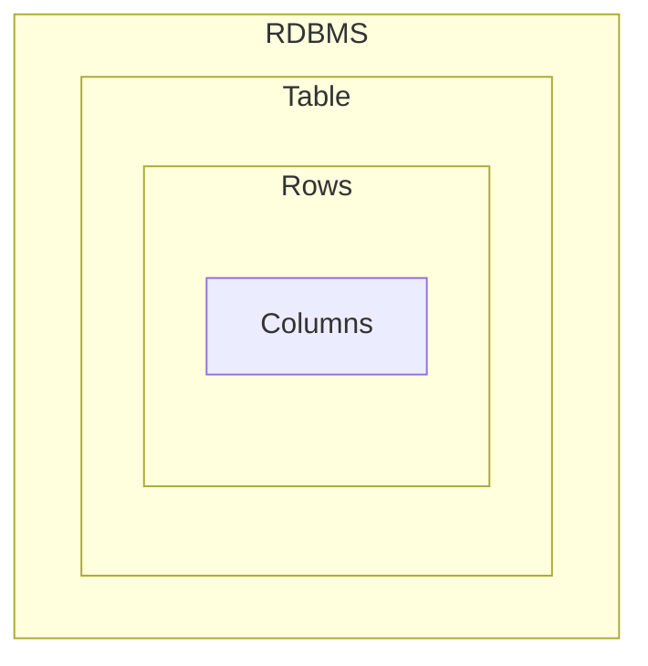
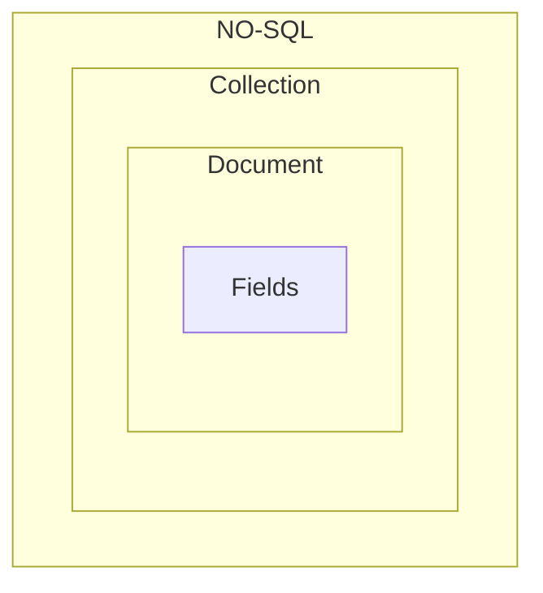

# <p style="color: Yellow; text-align: center;"> Be a Mongoose Master</p>

## What is mongoDB ?

- MongoDB is an NO-SQL Database, Which store JSON like documents.
- Mongo Stores data like `BSON Format`.
- No-SQL databases break from relational models, ideal for managing vast data.
- MongoDB stands out for it's `scalability`, `flexibility` and `performance`
  trusted by giants like Facebook , Google, EBay.
- MongoDB is Developed By `MongoDB Inc`

## Why we use `MongoDB` ?

- Highly Scalable, High-performance and Open-source.
- Document Oriented Database
- Cost Effective Solutions.
- Rich Ecosystem of Tools, Documents and community.

## What is the different between MongoDB & Relational Database.

|  Features   |                 MongoDB                 | Relational Database |
| :---------: | :-------------------------------------: | :-----------------: |
| Data Model  |            Document Oriented            |     Relational      |
|   Schema    |                Flexible                 |        RigId        |
| Scalability |        Horizontally & Vertically        |     Vertically      |
| Performance | Optimized Structure or UnStructure Data |  On Structured Dat  |

## Main Difference MongDB and Relational Database:

| RDBMS  |  Mongodb   |
| :----: | :--------: |
| Table  | Collection |
|  Rows  | Documents  |
| Column |   Fields   |





## MongoDB Features:

- JSON Like Documents (BSON).
- Indexing
- Aggregation Framework.
- Security Features
- Free Atlas Database
- MongoDB Compass GUI

## Setup MongoDB in Computer :

- Download MongoDB for windows.
- Install mongodb for windows
- When we install mongoDB with `Mongo Compass` automatically installed.
- ##### `MongoDB Shell` :
  - Download mongoDB shell msi version
  - install It.
  - Then go your local drive.
  - Copy this bin folder path:
  ```js
     C:\Program Files\MongoDB\Server\7.0\bin
  ```
  - Search on window : for `Environment Variable` and setup `then click ` on
    path.
  - Add a new path
  - the save it.
- ##### Use mongo shell or `mongosh `:
  - run this command to check `mongosh version`:
  ```js
     mongod --version
  ```
  - to use `mongoDB shell` on `CMD` the command :
  ```js
  mongosh;
  ```
  - the run any command of mongodb to access database.

# MongoDB Shell `Function` & `Operation` :

|               Function               |             for use             |                  example                  |
| :----------------------------------: | :-----------------------------: | :---------------------------------------: |
|             ` show dbs`              |        show all database        |                `show dbs`                 |
|            `use database`            |      create new or switch       |              `use developer`              |
|    `db.createCollection("name")`     |      create new collection      |  `db.createCollection('MernDeveloper')`   |
| `db.getCollection("collectionName")` |         get Collection          |    `db.getCollection('MernDeveloper')`    |
|         `db.collectionName`          |   get Collection another way    |            `db.MernDeveloper`             |
|  `db.collectionName.insert(object)`  | insert data into the collection | `db.MernDeveloper.insert({name:'soyeb'})` |
|      `db.collectionName.find()`      |  find data from the collection  |         `db.MernDeveloper.find()`         |

# Third Party site for GUI for Mongodb

- studio 3T
- No sql booster - paid but 1 month for trail

# crud

```js
db.test.findOne({ gender: "Female" });
db.test.findOne({ gender: "Female" }, { gender: 1, name: 1 }); //field filtering. gender:1 means gender field is true & will provide only gender data.
// here is another way with project
db.test.find({ gender: "Female" }).project({ gender: 1, name: 1, email: 1 });
// project wont work with findOne

// $gt,$gte,$lt,$lte,$eq,$neq
db.test.find({ age: { $gte: 30 } }); //return those data whose age greater than 30

// implicit and or
db.test.find({ age: { $gte: 30, $lt: 100 } }, { age: 1 }).sort({ age: 1 }); //return those data whose age greater than 30 and less than 100. will provide only age data and descending order
db.test
  .find({ gender: "Female", age: { $gte: 30, $lt: 100 } }, { age: 1 })
  .sort({ age: 1 }); //return those data whose gender is female, age greater than 30 and less than 100. will provide only age data and descending order

db.test
  .find(
    { gender: "Female", interests: "cooking", age: { $gte: 30, $lt: 100 } },
    { age: 1, gender: 1 }
  )
  .sort({ age: 1 }); //return those data whose gender is female, interested in cooking  age greater than 30 and less than 100. will provide only age data and descending order
db.test
  .find(
    {
      gender: "Female",
      interests: { $in: ["Cooking", "Gaming"] },
      age: { $gte: 30, $lt: 100 },
    }
  { age: 1,interests:1,gender:1 }
  )
  .sort({ age: 1 });
//return those data whose gender is female, interested in cooking or gaming, age greater than 30 and less than 100. will provide  age,gender, interests data and descending order

// explicitly $and
db.test.find({$and:[
   { age:{$gt:10}},

  { gender:'Male'},

  { interests:{$in:['Traveling','Cooking']}},

]}).project({age:1,gender:1,interests:1}).sort({age:1}) // whose age greater than 10 gender male and interest in traveling or cooking
// explicitly $or
db.test.find({
    $or:[
   { age:{$eq:10}},
   { age:{$eq:30}},
   {interests:'hjbuh'}

]}).project({age:1,gender:1,interests:1}).sort({age:1}) //only age 30 available


// $Exist
db.test.find({gender:{$exists:false}}) // return those data which dont have this field data
db.test.find({gender:{$exists:true}}) //return those data whose has this field
// it doesnt matter if that field had null or undefined value

// $type
 // we can find out data with the type of a value in field
db.test.find({age:{$type:'string'}})

// $size
//findout data by array size
db.test.find({friends:{$size:4}})

// $all
// with $all we can find field with the value in interests field's array. position of the value in index doesnt matter. if exist then return
db.test.find({interests:{$all:["Cooking","Gaming"]}}).project({interests:1})


// $elemMatch
db.test.find({skills:{$elemMatch:{
    name:'JAVASCRIPT',
    level:'Intermidiate'
}}}).project({skills:1}) //will match the element in a object then return


// update
// $set -> dont use $set with non-primitive data type it will change the data structure. like : interests:['gaming','shopping']
// now I want to update with traveling
// if I try with $set
/*$set:
interest:['traveling']
....
updated : interest:['traveling'] changed the array

*/
//main data
{
	"_id" : ObjectId("6406ad63fc13ae5a40000069"),
	"interests" : [ "Gaming", "Cooking", "Writting" ]
}
// updating data
db.test.updateOne({_id: ObjectId("6406ad63fc13ae5a40000069")},{
    $set:{
        interests:['Gaming']
    }
})
// updated data
{
	"_id" : ObjectId("6406ad63fc13ae5a40000069"),
	"interests" : [ "Gaming" ]
}
// if you dont want to chnage the whole think but add sometthing in existed array of data
// $addToSet
db.test.updateOne({_id: ObjectId("6406ad63fc13ae5a40000069")},{
    $addToSet: {
        interests:'Cooking',
    }
})
//   updated data
{
	"_id" : ObjectId("6406ad63fc13ae5a40000069"),
	"interests" : [ "Gaming", "Cooking" ]
}

// update with $each
// add more than One value in aarray with $addToSet
db.test.updateOne({_id: ObjectId("6406ad63fc13ae5a40000069")},{
    $addToSet: {
        interests:{$each: ['Shopping','Eating']}
    }
})
//   updated data
{
	"_id" : ObjectId("6406ad63fc13ae5a40000069"),
	"interests" : [ "Gaming", "Cooking", "Shopping", "Eating" ]
}

// with $push we can add duplicate data
db.test.updateOne({_id: ObjectId("6406ad63fc13ae5a40000069")},{
    $push: {
        interests:{$each: ['Shopping','Eating']}
    }
})
// updated data
{
	"_id" : ObjectId("6406ad63fc13ae5a40000069"),
	"interests" : [
		"Gaming",
		"Cooking",
		"Shopping",
		"Eating",
		"Shopping",
		"Eating"
	]
}
// update a property with $set in a object
db.test.updateOne({_id: ObjectId("6406ad64fc13ae5a40000073")},{
    $set: {
        'address.city':'Dhakaaaa'

    }
})

// update a property with $set in a ARRAY of object
db.test.updateOne({_id: ObjectId("6406ad64fc13ae5a40000073"),"education.degree":"Bachelor of Science"},{
    $set: {
        "education.$.year":2030 //$ operator

    }
})


// $unset -> remove a particular field
// update by remove a field
db.test.updateOne({_id: ObjectId("6406ad63fc13ae5a40000069")},{
    $unset: {
        email:""
    }
})

// $pop
// with this we can remove a data from the last of an array
db.test.updateOne({_id: ObjectId("6406ad63fc13ae5a40000069")},{
    $pop: {
        friends:1 //if i use negative one it will remove from first
    }
})
// $pull like pop but with different approach, I can specify which one should be removed
db.test.updateOne({_id: ObjectId("6406ad63fc13ae5a40000069")},{
    $pull: {
        friends:"Mizanur Rahman"
    }
})

// $pullAll
// more than One data from an array
db.test.updateOne({_id: ObjectId("6406ad63fc13ae5a40000069")},{
    $pullAll: {
        friends:[ "Abdur Rakib", "Najmus Sakib", "Mir Hussain" ]
    }
})

//


```

## Projection or `Field Filtering` with MongoDB:

- We can `project`field by using `project()` or by passing second parameter of
  `find({}, field filter object)` and `findOne(query, field filter object)`
- ### By passing second parameter of `find() or findOne()`:

  - `1` means keep the property `0` means remove the property.

  - syntax: here

  ```js
  db.collectionName.find(
    {},
    { _id: 0, propertyName: 1, propertyName: 1, propertyName: 1 }
  );
  ```

  - Example:

  ```js
  // inclusion
  db.test.find({ company: "Flashspan" }, { name: 1, email: 1, gender: 1 });

  // exclusion:
  db.test.find(
    { company: "Flashspan" },
    { name: 0, email: 0, gender: 0, _id: 0 }
  );
  ```

- ## `projection()` or `project()` method:

  - `projection()` and `project()` aren't work for `findOne()` method.
  - we can pass `1` or `0` as property value.
  - `1` mean get the property
  - `0` means remove the property

  - syntax :

  ```js
  // inclusion
  db.test.find({}).project({ name: 1, email: 1 });
  db.test.find({ age: 12 }).projection({ name: 1, email: 1, age: 1 });

  // exclusion:
  db.test.find().project({ _id: 0 });
  db.test.find().projection({ _id: 0 });
  ```

## `Operator` In MongoDB:-

- #### Thumb Rule : যখন কোনো `Operator` আসবে তখন একটা সেকেন্ড ব্রেকেট `{ }` আনতে হবে।
- ##### Comparison Operator :

  | Operator |                    why use                    |                   syntax                    |                     example                     |
  | :------: | :-------------------------------------------: | :-----------------------------------------: | :---------------------------------------------: |
  |  `$eq `  |             to check equal value              |         `{<field>: {$eq: value }}`          |        `db.test.find({age: {$eq: 12}})`         |
  |  `$ne`   |           to check not equal value            |         `{<field>: {$ne: value }}`          |        `db.test.find({age: {$ne: 12}})`         |
  |  `$gt`   |             get the larger value              |         `{<field>: {$gt: value }}`          |        `db.test.find({age: {$gt: 12}})`         |
  |  `$lt`   |             get the smaller value             |         `{<field>: {$lt: value }}`          |        `db.test.find({age: {$lt: 12}})`         |
  |  `$gte`  |           get larger & equal value            |         `{<field>: {$gte: value }}`         |        `db.test.find({age: {$gte: 12}})`        |
  |  `$lte`  |           get smaller & equal value           |         `{<field>: {$lte: value }}`         |        `db.test.find({age: {$lte: 12}})`        |
  |  `$in`   |   get data which matched with array of data   | `{<field>: {$in: [value, value, value] }}`  | `db.test.find({age: {$in: [12, 20, 21, 24]}})`  |
  |  `$nin`  | get data which not matched with array of data | `{<field>: {$nin: [value, value, value] }}` | `db.test.find({age: {$nin: [12, 20, 21, 24]}})` |

- ##### Logical Operator :
  | Operator |                                  why use                                   |                 syntax                  |                                                                                                             example                                                                                                              |
  | :------: | :------------------------------------------------------------------------: | :-------------------------------------: | :------------------------------------------------------------------------------------------------------------------------------------------------------------------------------------------------------------------------------: |
  |  `$and`  |                 return data if multiple condition is true                  |    `{$and: [exp, exp, exp... exp]}`     |                                       `db.test.find({$and: [{age : {$lt: 20} },{'skills.name' : "JAVASCRIPT"},{'skills.name' : "PYTHON"}]}).project({name: 1, age: 1, "skills.name": 1})`                                        |
  |  `$or`   |                   if any expression is true return data                    |     `{$or: [exp, exp, exp... exp]}`     |                                        `db.test.find({$or: [{age : {$lt: 20} },{'skills.name' : "JAVASCRIPT"},{'skills.name' : "PYTHON"}]}).project({name: 1, age: 1, "skills.name": 1})`                                        |
  |  `$not`  |                   if any expression is true return data                    | `{field:{$not: {operator expression}}}` |                                                                            `db.test.find({age: {$not: {$gte: 50}}}).sort({age: 1}).project({age: 1})`                                                                            |
  |  `$nor`  | selects the documents that fail all of the query expressions in the array. |    `{field:{$nor: [exp, exp, exp]}}`    | `db.test.find({$nor: [{age: {$in: [7,8,10,12,20,30,40,50,60]}}, {"skills.name": "JAVASCRIPT"}]}).project({age: 1, 'skills.name': 1}).sort({age: 1}) ` `db.test.find({age: {$not: {$gte: 50}}}).sort({age: 1}).project({age: 1})` |

## `Implicit` & `Explicit` `$and` in MongoDB.

- ### `Implicit $and` : When we need write multiple condition for `same filed` we can use `implicit` `$and`.

  - we can separate every `condition` with comma `(,)`.
  - syntax:

  ```js
  // we write implicit and for same field.
     {field:  {$gt: 12, $lt: 30}}
  // we write implicit and for query with multiple :
     {field: value, field: value, filed: value} // it's also implicit $and

  ```

- ### `Explicit $and: `
  - syntax:
  ```js
  {
    $and: [expression, expression, expression];
  }
  ```
  - Example:
  ```js
  db.test
    .find({
      $and: [
        { age: { $gt: 20 } },
        { gender: "Female" },
        { "skills.name": "JAVASCRIPT" },
        { "skills.name": "PYTHON" },
      ],
    })
    .project({ gender: 1, skills: 1 });
  ```
- Example 2:

```js
db.test
  .find({
    $and: [
      { age: { $gt: 10, $lt: 30 } },
      { gender: "Male" },
      { interests: { $in: ["Gaming", "Reading"] } },
      { "skills.name": { $in: ["JAVASCRIPT"] } },
      { "skills.name": { $in: ["C#"] } },
    ],
  })
  .project({
    age: 1,
    gender: 1,
    interests: 1,
    skills: 1,
  });
```

## `Implicit` and `Explicit` `$or`:

- ### Explicit `$or` :

  - We can explicitly use `$or` operator
  - syntax:

  ```ts
  {
    $or: [expression, expression, expression];
  }
  ```

  - Example:

  ```ts
  // find the user who have skills on Python or Javascript.
  db.test
    .find({
      $or: [{ "skills.name": "PYTHON" }, { "skills.name": "JAVASCRIPT" }],
    })
    .project({
      skills: 1,
    });
  ```

- ### Implicit `$or`: we can use `implicit` for same filed with `$in` operator.
  - `$in` operator implicitly worked like `$or` operator.
  ```js
  db.test.find({ age: { $in: [10, 20, 30, 40] } });
  ```
  # Delete document and a Entire collection
  ```js
  db.test.deleteOne({ _id: Object("6406ad64fc13ae5a40000073") });
  ```
  ##
