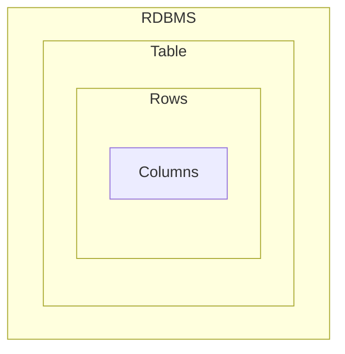
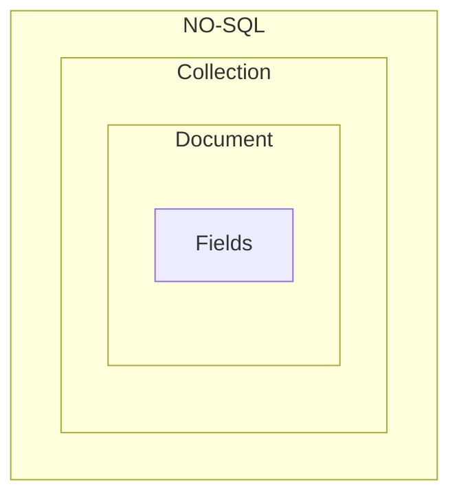

# <p style="color: Yellow; text-align: center;"> Be a Mongoose Master</p>

## What is mongoDB ?

- MongoDB is an NO-SQL Database, Which store JSON like documents.
- Mongo Stores data like `BSON Format`.
- No-SQL databases break from relational models, ideal for managing vast data.
- MongoDB stands out for it's `scalability`, `flexibility` and `performance`
  trusted by giants like Facebook , Google, EBay.
- MongoDB is Developed By `MongoDB Inc`

## Why we use `MongoDB` ?

- Highly Scalable, High-performance and Open-source.
- Document Oriented Database
- Cost Effective Solutions.
- Rich Ecosystem of Tools, Documents and community.

## What is the different between MongoDB & Relational Database.

|  Features   |                 MongoDB                 | Relational Database |
| :---------: | :-------------------------------------: | :-----------------: |
| Data Model  |            Document Oriented            |     Relational      |
|   Schema    |                Flexible                 |        RigId        |
| Scalability |        Horizontally & Vertically        |     Vertically      |
| Performance | Optimized Structure or UnStructure Data |  On Structured Dat  |

## Main Difference MongDB and Relational Database:

| RDBMS  |  Mongodb   |
| :----: | :--------: |
| Table  | Collection |
|  Rows  | Documents  |
| Column |   Fields   |





## MongoDB Features:

- JSON Like Documents (BSON).
- Indexing
- Aggregation Framework.
- Security Features
- Free Atlas Database
- MongoDB Compass GUI

## Setup MongoDB in Computer :

- Download MongoDB for windows.
- Install mongodb for windows
- When we install mongoDB with `Mongo Compass` automatically installed.
- ##### `MongoDB Shell` :
  - Download mongoDB shell msi version
  - install It.
  - Then go your local drive.
  - Copy this bin folder path:
  ```js
     C:\Program Files\MongoDB\Server\7.0\bin
  ```
  - Search on window : for `Environment Variable` and setup `then click ` on
    path.
  - Add a new path
  - the save it.
- ##### Use mongo shell or `mongosh `:
  - run this command to check `mongosh version`:
  ```js
     mongod --version
  ```
  - to use `mongoDB shell` on `CMD` the command :
  ```js
  mongosh;
  ```
  - the run any command of mongodb to access database.

# MongoDB Shell `Function` & `Operation` :

|               Function               |             for use             |                  example                  |
| :----------------------------------: | :-----------------------------: | :---------------------------------------: |
|             ` show dbs`              |        show all database        |                `show dbs`                 |
|            `use database`            |      create new or switch       |              `use developer`              |
|    `db.createCollection("name")`     |      create new collection      |  `db.createCollection('MernDeveloper')`   |
| `db.getCollection("collectionName")` |         get Collection          |    `db.getCollection('MernDeveloper')`    |
|         `db.collectionName`          |   get Collection another way    |            `db.MernDeveloper`             |
|  `db.collectionName.insert(object)`  | insert data into the collection | `db.MernDeveloper.insert({name:'soyeb'})` |
|      `db.collectionName.find()`      |  find data from the collection  |         `db.MernDeveloper.find()`         |

# Third Party site for GUI for Mongodb

- studio 3T
- No sql booster - paid but 1 month for trail

# crud

```js
db.test.findOne({ gender: "Female" });
db.test.findOne({ gender: "Female" }, { gender: 1, name: 1 }); //field filtering. gender:1 means gender field is true & will provide only gender data.
// here is another way with project
db.test.find({ gender: "Female" }).project({ gender: 1, name: 1, email: 1 });
// project wont work with findOne

// $gt,$gte,$lt,$lte,$eq,$neq
db.test.find({ age: { $gte: 30 } }); //return those data whose age greater than 30

// implicit and or
db.test.find({ age: { $gte: 30, $lt: 100 } }, { age: 1 }).sort({ age: 1 }); //return those data whose age greater than 30 and less than 100. will provide only age data and descending order
db.test
  .find({ gender: "Female", age: { $gte: 30, $lt: 100 } }, { age: 1 })
  .sort({ age: 1 }); //return those data whose gender is female, age greater than 30 and less than 100. will provide only age data and descending order

db.test
  .find(
    { gender: "Female", interests: "cooking", age: { $gte: 30, $lt: 100 } },
    { age: 1, gender: 1 }
  )
  .sort({ age: 1 }); //return those data whose gender is female, interested in cooking  age greater than 30 and less than 100. will provide only age data and descending order
db.test
  .find(
    {
      gender: "Female",
      interests: { $in: ["Cooking", "Gaming"] },
      age: { $gte: 30, $lt: 100 },
    }
  { age: 1,interests:1,gender:1 }
  )
  .sort({ age: 1 });
//return those data whose gender is female, interested in cooking or gaming, age greater than 30 and less than 100. will provide  age,gender, interests data and descending order

// explicitly $and
db.test.find({$and:[
   { age:{$gt:10}},

  { gender:'Male'},

  { interests:{$in:['Traveling','Cooking']}},

]}).project({age:1,gender:1,interests:1}).sort({age:1}) // whose age greater than 10 gender male and interest in traveling or cooking
// explicitly $or
db.test.find({
    $or:[
   { age:{$eq:10}},
   { age:{$eq:30}},
   {interests:'hjbuh'}

]}).project({age:1,gender:1,interests:1}).sort({age:1}) //only age 30 available


// $Exist
db.test.find({gender:{$exists:false}}) // return those data which dont have this field data
db.test.find({gender:{$exists:true}}) //return those data whose has this field
// it doesnt matter if that field had null or undefined value

// $type
 // we can find out data with the type of a value in field
db.test.find({age:{$type:'string'}})

// $size
//findout data by array size
db.test.find({friends:{$size:4}})

// $all
// with $all we can find field with the value in interests field's array. position of the value in index doesnt matter. if exist then return
db.test.find({interests:{$all:["Cooking","Gaming"]}}).project({interests:1})


// $elemMatch
db.test.find({skills:{$elemMatch:{
    name:'JAVASCRIPT',
    level:'Intermidiate'
}}}).project({skills:1}) //will match the element in a object then return


// update
// $set -> dont use $set with non-primitive data type it will change the data structure. like : interests:['gaming','shopping']
// now I want to update with traveling
// if I try with $set
/*$set:
interest:['traveling']
....
updated : interest:['traveling'] changed the array

*/
//main data
{
	"_id" : ObjectId("6406ad63fc13ae5a40000069"),
	"interests" : [ "Gaming", "Cooking", "Writting" ]
}
// updating data
db.test.updateOne({_id: ObjectId("6406ad63fc13ae5a40000069")},{
    $set:{
        interests:['Gaming']
    }
})
// updated data
{
	"_id" : ObjectId("6406ad63fc13ae5a40000069"),
	"interests" : [ "Gaming" ]
}
// if you dont want to chnage the whole think but add sometthing in existed array of data
// $addToSet
db.test.updateOne({_id: ObjectId("6406ad63fc13ae5a40000069")},{
    $addToSet: {
        interests:'Cooking',
    }
})
//   updated data
{
	"_id" : ObjectId("6406ad63fc13ae5a40000069"),
	"interests" : [ "Gaming", "Cooking" ]
}

```
